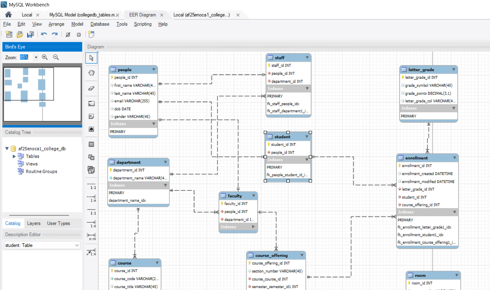

---

# 🎓 College Database Project (Version 1.2)

This project defines a relational database schema for managing a college's academic system using **MySQL**. It includes support for students, faculty, staff, courses, departments, enrollment, grades, rooms, and semesters.

Designed for use with **MySQL Workbench EER Diagrams**, this schema enforces key **relational constraints** and supports **normalized data** suitable for reporting and extensions.

---

## 📑 Table of Contents

1. [🗃️ Entities and Relationships](#️-entities-and-relationships)

   * [📌 Main Tables](#-main-tables)
2. [📋 Table Structure Summary](#-table-structure-summary)

   * [`People`](#people)
   * [`Student`](#student)
   * [`Faculty`](#faculty)
   * [`Staff`](#staff)
   * [`Department`](#department)
   * [`Semester`](#semester)
   * [`Course`](#course)
   * [`Room`](#room)
   * [`Course_Offering`](#course_offering)
   * [`Enrollment`](#enrollment)
3. [🔐 Constraints & Notes](#-constraints--notes)
4. [📂 Files](#-files)
5. [🚀 Getting Started](#-getting-started)
6. [📈 Future Enhancements (Version 2+)](#-future-enhancements-version-2)
7. [👥 Contributors](#-contributors)
8. [💬 Feedback or Contributions?](#-feedback-or-contributions)

---

## 🗃️ Entities and Relationships

### 📌 Main Tables

| Table             | Description                                                                                        |
| ----------------- | -------------------------------------------------------------------------------------------------- |
| `People`          | Stores all individuals (base table).                                                               |
| `Student`         | Subtype of `People`, stores student-specific info.                                                 |
| `Faculty`         | Subtype of `People`, stores faculty-specific info.                                                 |
| `Staff`           | Subtype of `People`, stores staff-specific info.                                                   |
| `Department`      | Contains college departments (e.g., CS, Math).                                                     |
| `Semester`        | Tracks academic terms like Fall 2025.                                                              |
| `Course`          | Master list of courses (e.g., CS101).                                                              |
| `Room`            | Physical rooms with capacity information.                                                          |
| `Course_Offering` | Represents a specific course section offered in a semester, assigned to a faculty member and room. |
| `Enrollment`      | Tracks student enrollment in course offerings, including final letter grades.                      |

---

## 📋 Table Structure Summary

### `People`

* `person_id`: Primary Key
* `first_name`, `last_name`, `email`

### `Student`

* `student_id`: Primary Key (FK → `People.person_id`)
* `major`, `year_of_study`

### `Faculty`

* `faculty_id`: Primary Key (FK → `People.person_id`)
* `department_id` (FK → `Department.department_id`)

### `Staff`

* `staff_id`: Primary Key (FK → `People.person_id`)
* `position`

### `Department`

* `department_id`: Primary Key
* `name`: Unique

### `Semester`

* `semester_id`: Primary Key
* `name`, `start_date`, `end_date`

### `Course`

* `course_id`: Primary Key
* `course_code`: Unique (e.g., CS101)
* `title`, `department_id` (FK)

### `Room`

* `room_id`: Primary Key
* `building`, `room_number`, `capacity`

### `Course_Offering`

* `offering_id`: Primary Key
* `course_id`, `semester_id`, `section`, `teacher_id`, `room_id`
* Unique Constraint: (`course_id`, `semester_id`, `section`)

### `Enrollment`

* `enrollment_id`: Primary Key
* `student_id`, `offering_id`, `letter_grade`
* Unique Constraint: (`student_id`, `offering_id`)

---

## 🔐 Constraints & Notes

* ✅ All foreign keys use `ON DELETE RESTRICT` by default.
* ✅ Room capacity is enforced via a `CHECK (capacity > 0)` constraint.
* 🎓 Only `student_id` from the `Student` table can enroll in courses.
* 🎓 Only `faculty_id` from the `Faculty` table can teach courses.

---

## 📂 Files

| File              | Description                                      |
| ----------------- | ------------------------------------------------ |
| `schema.sql`      | SQL script to create the full database schema    |
| `sample_data.sql` | Script to populate the database with sample data |
| `README.md`       | Project documentation                            |
| `college_eer.mwb` | *(Optional)* MySQL Workbench EER diagram file    |

---

## 🚀 Getting Started

1. Open **MySQL Workbench**
2. Create a new schema/database
3. Run the contents of `schema.sql`
4. Optionally, run `sample_data.sql` to preload the database
5. (Optional) Use `college_eer.mwb` to view or edit the EER diagram visually

---

## �️ EER Diagram

The EER diagram for this project is included as an image. Place the screenshot file in an `images/` folder at the repository root and reference it from here. The expected path is `images/Screenshot 2025-09-16 023136.png`.

## �📈 Future Enhancements (Version 2+)

* ✅ Triggers to enforce role-based logic (students vs faculty)
* ✅ Room booking constraints by time slots
* ✅ Prerequisite relationships between courses
* ✅ Attendance and assignment tracking
* ✅ Stored procedures and views

---

## 👥 Contributors

* [Enoch Atuahene](https://github.com/Typher7)
* [Williams Asante](https://github.com/Kraeon20)

---

## 💬 Feedback or Contributions?

Feel free to open an issue or submit a pull request if you’d like to improve or expand this database project!

